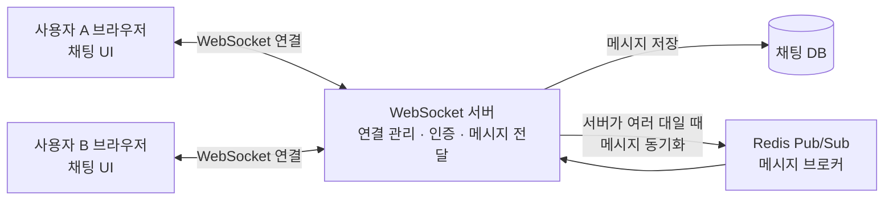
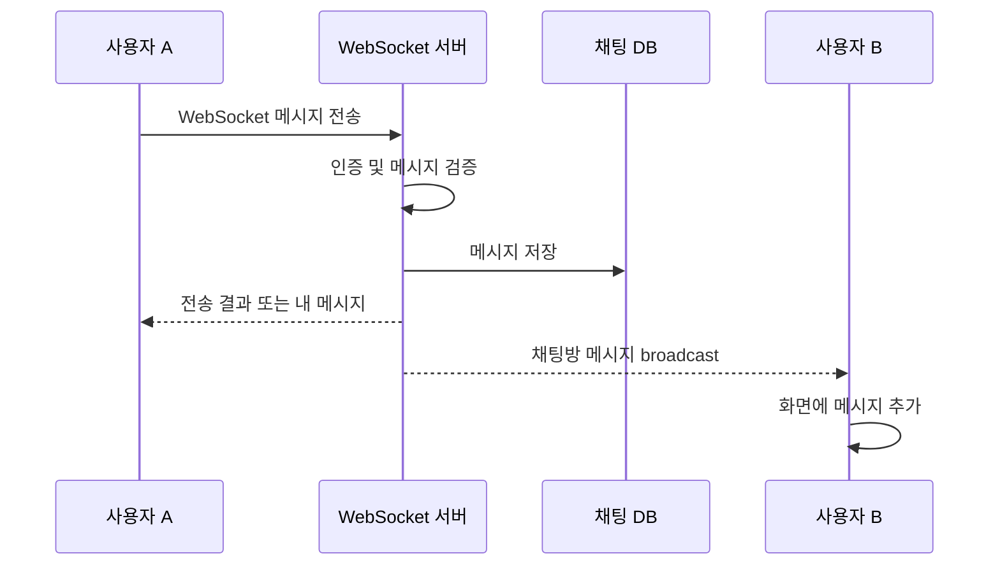

# WebSocket

## WebSocket이란?

WebSocket은 클라이언트와 서버가 하나의 연결을 계속 유지하면서 서로 자유롭게 데이터를 주고받을 수 있게 해주는 통신 프로토콜입니다.

일반적으로 처음 연결할 때는 HTTP 요청을 사용해 WebSocket 연결로 전환(handshake)합니다. 연결이 완료되면 클라이언트와 서버 모두 필요할 때 즉시 메시지를 보낼 수 있습니다.

## HTTP와 WebSocket의 차이

| 구분 | HTTP | WebSocket |
| --- | --- | --- |
| 통신 방식 | 클라이언트 요청 후 서버 응답 | 클라이언트와 서버가 양방향으로 통신 |
| 연결 유지 | 요청과 응답이 끝나면 연결이 종료되거나 재사용됨 | 연결을 계속 유지 |
| 데이터 전달 시점 | 클라이언트가 요청해야 서버가 응답 | 서버가 먼저 데이터를 보낼 수 있음 |
| 실시간성 | 주기적인 polling 등이 필요할 수 있음 | 메시지가 발생하면 즉시 전달 |
| 적합한 서비스 | 게시글 조회, 일반 API, 파일 요청 | 채팅, 알림, 실시간 게임, 주식 시세 |
| 통신 오버헤드 | 요청마다 HTTP 헤더가 포함될 수 있음 | 연결 후에는 작은 프레임 단위로 전송 |

## 실시간 채팅 서비스의 전체 구조



메시지 전달 과정은 다음과 같습니다.



### 기본 연결 구조

```text
사용자 A 브라우저 ── WebSocket ──┐
                                  ├── WebSocket 서버 ── 메시지 저장소/DB
사용자 B 브라우저 ── WebSocket ──┘
```

1. 사용자가 채팅 페이지에 접속하면 브라우저가 WebSocket 서버에 연결합니다.
2. 서버는 연결된 클라이언트와 사용자 정보를 관리합니다.
3. 사용자가 메시지를 보내면 브라우저가 WebSocket을 통해 서버로 메시지를 전송합니다.
4. 서버는 메시지를 검증하고 필요하다면 DB에 저장합니다.
5. 서버는 해당 채팅방에 참여 중인 다른 사용자들에게 메시지를 전달(broadcast)합니다.
6. 각 브라우저는 서버에서 받은 메시지를 `li` 같은 화면 요소로 추가해 채팅 내용을 갱신합니다.

## 메시지 흐름 예시

```text
사용자 A 입력
    ↓
클라이언트 WebSocket.send()
    ↓
서버 메시지 수신 및 검증
    ↓
DB 저장
    ↓
채팅방 사용자들에게 broadcast
    ↓
각 클라이언트의 WebSocket.onmessage
    ↓
채팅 화면에 메시지 추가
```

## 구현할 때 고려할 점

- 연결이 끊겼을 때 재연결하는 로직을 준비합니다.
- 로그인 사용자만 연결하거나 메시지를 보낼 수 있도록 인증을 적용합니다.
- 메시지 내용은 서버에서 다시 검증하고, 화면에 출력할 때 XSS 공격을 방지합니다.
- 사용자가 채팅방을 나가거나 브라우저를 닫으면 서버에서 연결 정보를 정리합니다.
- 서버가 여러 대라면 Redis Pub/Sub 같은 메시지 브로커를 사용해 서버 간 메시지를 공유할 수 있습니다.
